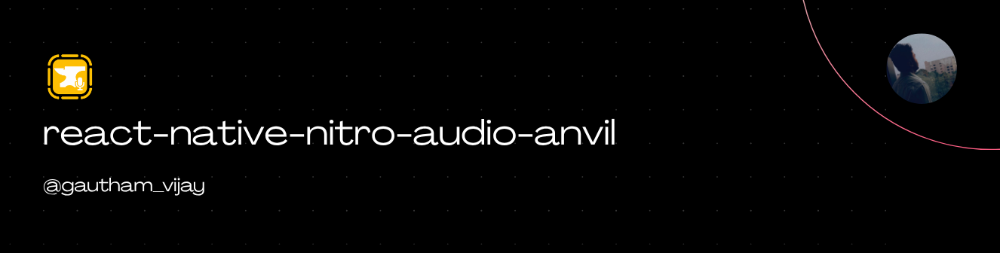
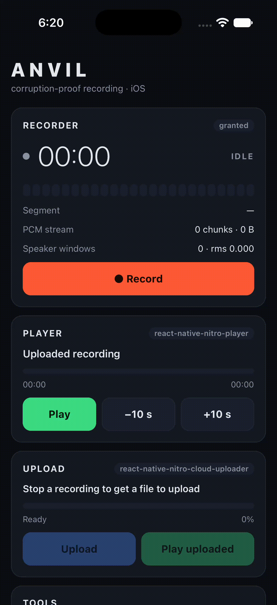

<a href="https://gauthamvijay.com">
  <picture>
    
  </picture>
</a>

# react-native-nitro-audio-anvil

**React Native Nitro Module** for **corruption-proof, long-form microphone recording** — PCM straight to disk, `fsync`ed and segmented, with live PCM and speaker-window streams. Built for the 60–90 minute recordings that must survive incoming calls, backgrounding, force-quits and dead batteries.

---

> [!NOTE]
>
> - This library was originally created for my production app, where we record **long conversations — 60 to 90 minutes** — on the phone that is also, well, a phone.
> - We started on `expo-audio`, and it served its purpose: it got us recording in an afternoon, and for short clips it is exactly the right tool. Then a customer took an incoming call 40 minutes into a recording. The encoder was torn down mid-write, the `.m4a` never got its index written, and the file was unrecoverable. Nobody did anything wrong — a container that needs a finalize step is simply the wrong shape for a recording that can be interrupted at any second.
> - **Losing an audio file is worse than most other failures**, because there is no retry. The customer already spoke. The moment is gone. If we lose the bytes, we lose the meeting — and with it any transcript, summary, action item or downstream analysis that depended on it. Everything else in a recording pipeline (transcription, upload, storage) can be retried. The recording itself cannot.
> - Anvil is built with **fault tolerance as the first design constraint, not a nice-to-have**. There is no encoder and no finalize step: raw PCM goes to a WAV file whose header is patched and `fsync`ed twice a second, in 30-second segments. A call, a crash or a power cut costs you at most half a second of audio — never a file. On next launch, `discoverOrphanedRecordings()` repairs any headers that never got a final patch and hands you back everything on disk. `RecordingService` groups sessions across the crash boundary so a 90-minute meeting interrupted mid-way still comes back as one logical recording.
>
> **What you get out of the box:**
>
> - Mono 16-bit WAV capture that is a valid file at every instant, not just at `stop()`
> - Segmentation every `segmentDurationMs` (default 30 s), rotated on pause, interruption and input-device change
> - Native handling of calls, Siri, alarms, media-server reset (iOS), audio-focus loss and capture-silenced (Android)
> - `PCMChunk` stream (default 100 ms) for streaming speech-to-text, with sequence numbers so gaps are detectable
> - Overlapping `SpeakerWindow` stream (default 1.5 s / 750 ms hop) for speaker labelling or diarization
> - `extractRange(startMs, endMs)` to re-read any span from disk, even while recording — useful when a streaming socket drops
> - `concatenate(paths, output)` to stitch segments into one WAV without re-encoding
> - `discoverOrphanedRecordings(dir)` with WAV header repair on relaunch
> - `createRecordingService()` to group sessions across crashes under your own id (meetingId, callId, …)
> - SHA-256 per finalized segment for integrity checks
> - Foreground-service notification on Android, `audio` background mode on iOS
>
> **What this library does NOT do** (by design):
>
> - **No encoding.** Nothing to opus, aac or mp3 on device. WAV out. Encode server-side if you want smaller files — do it after the bytes are safely off the device, never before.
> - **No transcription, no VAD, no speaker embedding, no summarization.** The `PCMChunk` and `SpeakerWindow` streams hand you the bytes; you pick the model and where it runs (cloud, on-device with ExecuTorch, whatever).
> - **No upload.** Pair with [`react-native-nitro-cloud-uploader`](https://github.com/Gautham495/react-native-nitro-cloud-uploader) for S3-compatible multipart uploads, or roll your own. The example app wires both.
> - **No playback.** Pair with [`react-native-nitro-player`](https://github.com/riteshshukla04/react-native-nitro-player) — every WAV Anvil writes plays as-is.
>
> If your app needs to record something long, on the same device that can be interrupted at any second, and you cannot afford to lose it — this is the recorder.

---

## 📦 Installation

```bash
yarn add react-native-nitro-audio-anvil react-native-nitro-modules
cd ios && pod install
```

> [!IMPORTANT]
>
> - **iOS**: Fully tested and production-ready ✅
>   - `AVAudioEngine` capture, `AVAudioSession` interruption / route / media-server-reset handling
>   - CallKit call detection, `audio` background mode
> - **Android**: Fully tested and production-ready ✅
>   - `AudioRecord` on a dedicated audio thread
>   - Microphone foreground service
>   - Audio focus + `isClientSilenced` interruption detection
>   - Requires Android 7.0+ (API 24+)
> - Tested on React Native 0.85+ with the New Architecture (required by Nitro Modules). PRs welcome for lower RN versions.

---

## 🎥 Demo

<table>
  <tr>
    <th align="center">🍏 iOS Demo</th>
    <th align="center">🤖 Android Demo</th>
  </tr>
  <tr>
    <td align="center">
    
    </td>
     <td align="center">
    
    </td>
  </tr>
</table>

The example app records with Anvil, plays the result with [react-native-nitro-player](https://github.com/riteshshukla04/react-native-nitro-player) and uploads it with [react-native-nitro-cloud-uploader](https://github.com/Gautham495/react-native-nitro-cloud-uploader) — the whole capture → play → upload flow on Nitro Modules.

> [!NOTE]
>
> The example uploads to my Cloudflare R2 bucket `test-bucket` via a public Worker at `https://api.gauthamvijay.com`, so you can run it end-to-end without setting up any backend. Uploaded files are automatically deleted after 3 days.
>
> ```tsx
> const BASE_URL = 'https://api.gauthamvijay.com';
> const CREATE_UPLOAD_URL = `${BASE_URL}/create-and-start-upload`;
> const COMPLETE_UPLOAD_URL = `${BASE_URL}/complete-upload`;
> const ABORT_UPLOAD_URL = `${BASE_URL}/abort-upload`;
> const SINGLE_UPLOAD_URL = `${BASE_URL}/single-upload`;
> ```

---

## 🧠 Overview

| Feature                     | Implementation                                                                   |
| --------------------------- | -------------------------------------------------------------------------------- |
| Format                      | Mono 16-bit PCM WAV, no encoder, no finalize step                                |
| Durability                  | Header patched + `fsync` every `fsyncIntervalMs` (default 500 ms)                |
| Segmentation                | New file every `segmentDurationMs`, on pause, interruption and route change      |
| Phone calls / Siri / alarms | Segment finalized **before** the OS takes the mic; event emitted                 |
| Bluetooth / headset changes | Route event + segment rotation so no file mixes two input devices                |
| Background recording        | iOS `audio` background mode / Android microphone foreground service              |
| Crash & force-quit recovery | `discoverOrphanedRecordings()` repairs headers; `RecordingService` re-groups     |
| Live PCM stream             | `PCMChunk`s (default 100 ms) for streaming speech-to-text, with sequence numbers |
| Speaker windows             | Overlapping `SpeakerWindow`s (default 1.5 s / 750 ms hop) for speaker labelling  |
| Range extraction            | `extractRange(startMs, endMs)` re-reads any span from disk, even while recording |
| Stitching                   | `concatenate(paths, output)` joins segments into one WAV without re-encoding     |
| Integrity                   | SHA-256 per finalized segment                                                    |
| Storage guard               | Warning event below a configurable free-space threshold                          |
| Threading                   | One owner thread per recorder, no locks, no JS-thread blocking                   |

---

## 🛡️ Fault tolerance, in detail

Every design decision in Anvil starts from the question "what happens if the process disappears right now?" Here is the answer for each failure mode:

| Failure                                | What Anvil does                                                                                                                                                  | What you get back                                                        |
| -------------------------------------- | ---------------------------------------------------------------------------------------------------------------------------------------------------------------- | ------------------------------------------------------------------------ |
| Incoming phone call                    | iOS `AVAudioSession.interruptionNotification` / Android audio focus loss → current segment is finalized (patched, `fsync`ed, hashed) before the OS takes the mic | An `interruption` event with a valid WAV path, then optional auto-resume |
| Bluetooth headset connect / disconnect | Route change → current segment finalized so no file mixes two input devices                                                                                      | A `routeChange` event and a fresh segment for the new device             |
| App backgrounded / screen locked       | iOS `audio` background mode / Android microphone foreground service keeps the capture running                                                                    | Recording continues; timer keeps advancing                               |
| App force-quit                         | Whatever was `fsync`ed is on disk. On next launch, `discoverOrphanedRecordings` repairs any headers that never got patched                                       | Every segment written, up to the last 500 ms                             |
| Process crash / OOM kill               | Same as force-quit — nothing to finalize, nothing to lose except the last 500 ms                                                                                 | Same as above                                                            |
| Device reboot / battery dies           | Same as force-quit                                                                                                                                               | Same as above                                                            |
| Streaming STT socket drops             | `extractRange(startMs, endMs)` re-reads exactly the missing span from disk                                                                                       | A WAV you can upload to a batch transcription endpoint                   |
| Free space low                         | Warning event on `start()` and every rotation, before it becomes an error                                                                                        | Time to prompt the user or rotate off the device                         |

There is no moov atom, no encoder state, no finalize step to skip. The file on disk is always a valid WAV, at every instant.

---

## ⚙️ Basic Usage

```ts
import { Anvil, type AnvilRecorder } from 'react-native-nitro-audio-anvil';

if ((await Anvil.requestPermission()) !== 'granted') return;

const recorder: AnvilRecorder = await Anvil.createRecorder({
  outputDirectory: `${documentDirectory}/recordings`, // plain path or file:// URL
  segmentDurationMs: 30_000,
  fsyncIntervalMs: 500,
  sampleRate: 16000,
  streamChunkMs: 100,
  speakerWindowMs: 1500,
  speakerWindowHopMs: 750,
  onInterruption: 'resume',
  keepAwakeInBackground: true,
  storageWarningBytes: 200 * 1024 * 1024,
  notification: { title: 'Recording', text: 'Tap to return' },
});

// Stream 1 → your streaming speech-to-text socket (pcm16, 16 kHz, mono — send the buffer as-is)
const pcm = recorder.addPCMListener((chunk) => socket.send(chunk.buffer));

// Stream 2 → your speaker-embedding model → label who is talking
const speaker = recorder.addSpeakerWindowListener(async (window) => {
  if (window.rms < 0.01) return; // silence
  const label = await labelSpeaker(window.buffer, window.startMs, window.endMs);
});

recorder.addInterruptionListener((e) => {
  // e.phase === 'began': e.segmentPath is already a valid file on disk
  // e.phase === 'ended' && !e.shouldResume: call recorder.resume() when you want
});
recorder.addSegmentCompletedListener((segment) => uploader.enqueue(segment));
recorder.addErrorListener((error) => log.error(error.code, error.message));

await recorder.start();
// ...
const segments = await recorder.stop();

pcm.remove();
speaker.remove();
```

### One file instead of segments

```ts
const full = await Anvil.concatenate(
  segments.map((s) => s.filePath),
  `${documentDirectory}/recordings/meeting-full.wav`
);
// full.filePath, full.durationMs, full.fileSize, full.sha256
```

### Recovering a gap in the stream

```ts
// Streaming socket dropped from media time 120000 to 135000 ms
const path = await recorder.extractRange(120_000, 135_000);
await transcribeFile(path); // your batch transcription endpoint
```

### After a crash

```ts
const orphaned = await Anvil.discoverOrphanedRecordings(recordingsDir);
for (const session of orphaned) uploader.enqueueAll(session.segments);
```

Headers are repaired and markers cleared before the sessions are returned; the WAV files stay on disk for you. To group sessions back into your own ids (meetingId, callId…) across a crash — so a 90-minute meeting interrupted mid-way comes back as one logical recording — use `createRecordingService`. See [`docs/recovery.md`](./docs/recovery.md).

---

## 🔁 Record → Play → Upload, all Nitro

Anvil produces plain WAV files, so the rest of the pipeline is whatever you already use. The example app wires it like this:

```ts
// Record
const segments = await recorder.stop();
const full = await Anvil.concatenate(
  segments.map((s) => s.filePath),
  outputPath
);

// Play — react-native-nitro-player
await PlayerQueue.addTrackToPlaylist(playlistId, {
  id: full.filePath,
  title: 'Recording',
  artist: 'Anvil',
  album: 'Recordings',
  duration: full.durationMs / 1000,
  url: `file://${full.filePath}`,
});
await TrackPlayer.playSong(full.filePath, playlistId);

// Upload — react-native-nitro-cloud-uploader (multipart presigned URLs, background, resumable)
await CloudUploader.startUpload(uploadId, full.filePath, uploadUrls, 3, true);
```

Every step is a Nitro Module and nothing crosses the old bridge. See [`example/`](./example) for the full app with a player card, an upload progress bar and "play the uploaded URL".

---

## 🔐 Permissions

### iOS — `Info.plist`

```xml
<key>NSMicrophoneUsageDescription</key>
<string>Records your conversations</string>
<key>UIBackgroundModes</key>
<array>
  <string>audio</string>
</array>
```

### Android

**Declared by the library and merged automatically:**

- `RECORD_AUDIO` — microphone capture
- `FOREGROUND_SERVICE` + `FOREGROUND_SERVICE_MICROPHONE` — background recording (`keepAwakeInBackground: true`)
- `WAKE_LOCK` — keep the CPU awake while recording in the background
- `POST_NOTIFICATIONS` — the foreground-service notification (Android 13+)

**A typical app manifest that works out of the box with Anvil, a player and an uploader:**

```xml
<uses-permission android:name="android.permission.INTERNET" />
<uses-permission android:name="android.permission.MODIFY_AUDIO_SETTINGS" />
<uses-permission android:name="android.permission.POST_NOTIFICATIONS" />
<uses-permission android:name="android.permission.RECORD_AUDIO" />
<uses-permission android:name="android.permission.WAKE_LOCK" />
<uses-permission android:name="android.permission.READ_EXTERNAL_STORAGE" android:maxSdkVersion="32" tools:replace="android:maxSdkVersion" />
<uses-permission android:name="android.permission.WRITE_EXTERNAL_STORAGE" android:maxSdkVersion="32" tools:replace="android:maxSdkVersion" />
```

`MODIFY_AUDIO_SETTINGS` is recommended: some OEMs need it for audio-focus and routing calls to behave. The storage permissions are only needed for apps that write outside their sandbox — Anvil writes to whatever directory you give it and needs none of them for the app's own document directory.

**Runtime permission for Android 13+**: request `POST_NOTIFICATIONS` before starting a background recording so the foreground-service notification is visible. Recording works either way; only the notification is hidden if denied.

```ts
import { PermissionsAndroid, Platform } from 'react-native';

if (Platform.OS === 'android' && Platform.Version >= 33) {
  await PermissionsAndroid.request(
    PermissionsAndroid.PERMISSIONS.POST_NOTIFICATIONS
  );
}
```

`keepAwakeInBackground: true` requires `notification` in the config and must be started while the app is in the foreground (Android 14+ rule).

---

## 📡 Events

| Listener                      | When                                                                             |
| ----------------------------- | -------------------------------------------------------------------------------- |
| `addPCMListener`              | every `streamChunkMs` while recording                                            |
| `addSpeakerWindowListener`    | every `speakerWindowHopMs` once a full window exists                             |
| `addInterruptionListener`     | OS took / returned the mic (`call`, `muted`, `route`, `reset`, `focus`, `other`) |
| `addRouteChangeListener`      | input device changed; segment rotated when the active input changed              |
| `addPermissionChangeListener` | mic permission differs from last check (checked on every start/resume)           |
| `addStorageWarningListener`   | free space below `storageWarningBytes` (checked at start and every rotation)     |
| `addSegmentCompletedListener` | a WAV file was finalized, with `sha256`                                          |
| `addErrorListener`            | pipeline failure; recorder moves to `interrupted`, data on disk is safe          |

`RecorderState`: `idle → recording ⇄ paused / interrupted → stopped`. `stop()` always resolves with every segment.

### Timeline

All timestamps (`PCMChunk.timestampMs`, `SpeakerWindow.startMs`, `RecordingSegment.mediaStartMs`, `extractRange`) are **media time**: milliseconds of captured audio, which only advance while capturing. That is the timeline a streaming transcription service sees, so joining transcript segments with speaker labels is a plain interval overlap.

---

## 🧩 Supported Platforms

| Platform             | Status                                           |
| -------------------- | ------------------------------------------------ |
| **iOS**              | ✅ Fully Supported                               |
| **Android**          | ✅ Fully Supported                               |
| **iOS Simulator**    | ✅ Works (host microphone)                       |
| **Android Emulator** | ✅ Works (emulator microphone is usually silent) |

Interruption, route-change and background behaviour cannot be verified on simulators — test on a real device before shipping.

---

## 🔧 Building the library

```sh
yarn install
yarn nitrogen        # generates nitrogen/generated from src/specs/*.nitro.ts
yarn typecheck
```

`nitrogen/generated/` must be committed and shipped in the npm package.

---

## 🤝 Contributing

Contributions are welcome!

- [Development Workflow](CONTRIBUTING.md#development-workflow)
- [Sending a Pull Request](CONTRIBUTING.md#sending-a-pull-request)
- [Code of Conduct](CODE_OF_CONDUCT.md)

---

## 🪪 License

MIT © [**Gautham Vijayan**](https://gauthamvijay.com)

---

Made with ❤️ and [**Nitro Modules**](https://nitro.margelo.com)
