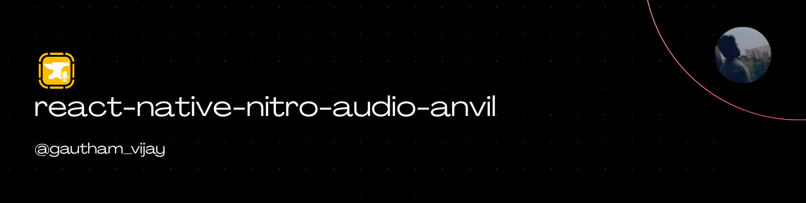
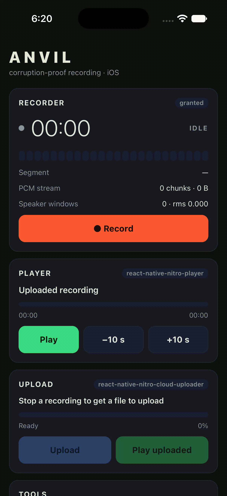

<a href="https://gauthamvijay.com">
  <picture>
    
  </picture>
</a>

# react-native-nitro-audio-anvil

**React Native Nitro Module** for **corruption-proof, long-form microphone recording** — PCM straight through an on-device AAC-LC encoder into ADTS segments and a live HLS manifest, `fsync`ed as it goes. Built for the 60–90 minute recordings that must survive incoming calls, backgrounding, force-quits and dead batteries — and stream live to your object store while they happen.

---

> [!NOTE]
>
> - This library was originally created for my production app, where we record **long conversations — 60 to 90 minutes** — on the phone that is also, well, a phone.
> - We started on `expo-audio`, and it served its purpose: it got us recording in an afternoon, and for short clips it is exactly the right tool. Then a customer took an incoming call 40 minutes into a recording. The encoder was torn down mid-write, the `.m4a` never got its index written, and the file was unrecoverable. Nobody did anything wrong — a container that needs a finalize step is simply the wrong shape for a recording that can be interrupted at any second.
> - **Losing an audio file is worse than most other failures**, because there is no retry. The customer already spoke. The moment is gone. If we lose the bytes, we lose the meeting — and with it any transcript, summary, action item or downstream analysis that depended on it. Everything else in a recording pipeline (transcription, upload, storage) can be retried. The recording itself cannot.
> - Anvil is built with **fault tolerance as the first design constraint, not a nice-to-have**. There is no container index and no finalize step: PCM is encoded frame-by-frame into **ADTS AAC-LC**, whose frames are self-describing — every frame carries its own header. A `.aac` file is a valid, playable file at every instant, not just at `stop()`. Segments are rotated every `segmentDurationMs` and `fsync`ed twice a second. A **live HLS manifest** is rewritten (tmp + rename + directory `fsync`) after every segment, so a call, a crash or a power cut costs you at most half a second of audio — never a file. On next launch, `discoverOrphanedRecordings()` walks the folder, validates every referenced segment as parseable ADTS, salvages any trailing unreferenced segment, and hands back a `RecoveredRecording` you can **resume**, **finalize** or **discard**.
> - Because the format is HLS out of the box, the same segments that survive crashes also **stream live to R2 (or any object store) during recording**. A per-segment sync agent PUTs each `.aac` and rewrites `manifest.m3u8` as it lands; anyone with the manifest URL can play the recording live in `hls.js`, `react-native-video` or AVPlayer while you're still capturing.
>
> **What you get out of the box:**
>
> - Mono ADTS AAC-LC capture — every segment is a playable file the moment `fsync` returns, no container to finalize
> - Live HLS manifest rewritten after every segment, sealed with `#EXT-X-ENDLIST` on `stop()`
> - **Folder-per-recording** layout under a `recordingId` you own — one folder, one manifest, one clean object-key prefix for uploads
> - Segmentation every `segmentDurationMs` (default 6 s), rotated on pause, interruption and input-device change
> - Native handling of calls, Siri, alarms, media-server reset (iOS), audio-focus loss and capture-silenced (Android)
> - **Auto-resume with exponential backoff** when another app releases the mic — WhatsApp, Voice Memos, Siri, phone calls
> - **Deferred-resume-on-foreground** for the case where the interruption ends while your app is backgrounded (both platforms have known bugs here — Anvil works around them)
> - `PCMChunk` stream (default 100 ms) for streaming speech-to-text, with sequence numbers so gaps are detectable
> - Overlapping `SpeakerWindow` stream (default 1.5 s / 750 ms hop) for speaker labelling or diarization
> - `Anvil.concatenate(dir, recordingId, out)` to stitch segments into one `.aac` without re-encoding (byte-copy of ADTS payloads)
> - `Anvil.discoverOrphanedRecordings(dir)` — folder-level recovery with manifest verification and ADTS frame scanning
> - Resume across a crash: `Anvil.createRecorder({ recordingId, resume: true, ... })` picks up in the same folder, adds `#EXT-X-DISCONTINUITY` on parameter changes
> - `Anvil.retryPendingUploads(dir)` for a second, independent recovery queue: files written locally but never confirmed uploaded via `.uploaded` sentinels
> - Foreground-service notification on Android, `audio` background mode on iOS
>
> **What this library does NOT do** (by design):
>
> - **No transcription, no VAD, no speaker embedding, no summarization.** The `PCMChunk` and `SpeakerWindow` streams hand you the bytes; you pick the model and where it runs (cloud, on-device with ExecuTorch, whatever).
> - **No upload transport.** Anvil emits `addSegmentCompletedListener` and `addManifestUpdatedListener` events with the file paths; you write the HTTP layer (a Cloudflare Worker + presigned R2 PUT URLs is ~40 lines — the example ships one). Anvil owns the disk; JS owns the network.
> - **No playback.** Any HLS player works — the example uses `react-native-video`'s hook API (`useVideoPlayer` + `VideoView`). Individual `.aac` segments play in VLC, ffmpeg, browsers or anything that speaks `audio/aac`; concatenated archives play everywhere.
>
> If your app needs to record something long, on the same device that can be interrupted at any second, and you cannot afford to lose it — this is the recorder. If you also need to stream it live to an object store while it's happening, this is that too.

---

## 📦 Installation

```bash
yarn add react-native-nitro-audio-anvil react-native-nitro-modules
cd ios && pod install
```

> [!IMPORTANT]
>
> - **iOS**: Fully tested and production-ready ✅
>   - `AVAudioEngine` capture → `AVAudioConverter` PCM→AAC-LC → ADTS wrapping
>   - `AVAudioSession` interruption / route / media-server-reset handling, `.default` mode
>   - CallKit call detection, `audio` background mode
>   - Auto-resume with exponential backoff (200 ms → 400 ms → 800 ms → 1.6 s → 3.2 s) when foreground
>   - See [iOS quirks](./docs/ios-quirks.md) for platform-specific gotchas (background reactivation bug, CarPlay, Bluetooth chaos, AAC-LC bitrate ceiling)
> - **Android**: Fully tested and production-ready ✅
>   - `AudioRecord` on a dedicated audio thread → `MediaCodec` AAC-LC encoder → ADTS wrapping
>   - Microphone foreground service
>   - Audio focus + `isClientSilenced` interruption detection
>   - Auto-resume with exponential backoff (300 ms → 600 ms → 1.2 s → 2.4 s → 4.8 s) when foreground
>   - Requires Android 7.0+ (API 24+)
>   - See [OEM quirks](./docs/oem-quirks.md) for per-brand walkthroughs (Xiaomi, Huawei, Oppo, Vivo, OnePlus, Samsung, and more)
> - Tested on React Native 0.85+ with the New Architecture (required by Nitro Modules). PRs welcome for lower RN versions.

---

## 🎥 Demo

<table>
  <tr>
    <th align="center">🍏 iOS Demo</th>
    <th align="center">🤖 Android Demo</th>
  </tr>
  <tr>
    <td align="center">
    
    </td>
     <td align="center">
    
    </td>
  </tr>
</table>

The example app records with Anvil, streams each segment live to Cloudflare R2 via a Worker that mints presigned PUT URLs, and plays the resulting HLS stream back with [react-native-video](https://github.com/TheWidlarzGroup/react-native-video) — the whole capture → stream → play flow, live, while you're still recording.

> [!NOTE]
>
> The example streams to my R2 bucket via a public Worker at `https://api.gauthamvijay.com`, and serves the manifest back from `https://hls-streaming.gauthamvijay.com/<recordingId>/manifest.m3u8`, so you can run it end-to-end without setting up any backend. Uploaded recordings are deleted after 3 days.
>
> ```tsx
> const BASE_URL = 'https://api.gauthamvijay.com';
> const HLS_PUT_URL = `${BASE_URL}/hls-put-url`;
> const HLS_PUBLIC_BASE = 'https://hls-streaming.gauthamvijay.com';
> ```

---

## 📚 Documentation

For long-form microphone recording, the library itself is only half the story. The other half is knowing the platform quirks that affect background audio.

| Doc                                          | When to read                                                                          |
| -------------------------------------------- | ------------------------------------------------------------------------------------- |
| [iOS quirks](./docs/ios-quirks.md)           | Before shipping on iOS — background reactivation bug, CarPlay, Bluetooth, bitrate ceiling |
| [OEM quirks](./docs/oem-quirks.md)           | Before shipping on Android — per-brand setup for Xiaomi, Huawei, Oppo, Vivo, and more |
| [Troubleshooting](./docs/troubleshooting.md) | When something breaks — symptom-first debugging with hypothesis and fix per symptom   |
| [Recovery](./docs/recovery.md)               | Folder-per-recording layout, `discoverOrphanedRecordings`, resume/finalize/discard    |

Every real-world quirk we have hit — background reactivation permanent-fail on iOS, HyperOS killing foreground services, WhatsApp holding the mic HAL, sample rate changes on Bluetooth route, AAC-LC bitrate ceiling at low sample rates — is documented in one of these files. If you hit something not covered, file an issue and it will land here.

---

## 🧠 Overview

| Feature                     | Implementation                                                                            |
| --------------------------- | ----------------------------------------------------------------------------------------- |
| Format                      | Mono ADTS AAC-LC, self-describing frames, no container index, no finalize step            |
| Layout                      | Folder-per-recording under a caller-owned `recordingId`; one `manifest.m3u8` + `NNNNN.aac` |
| Durability                  | `fsync` every `fsyncIntervalMs` (default 500 ms); manifest rewritten tmp+rename+dir-fsync  |
| Segmentation                | New file every `segmentDurationMs`, on pause, interruption and route change               |
| Live streaming              | HLS out of the box — same segments feed local disk and per-file sync agent to your CDN     |
| Phone calls / Siri / alarms | Segment finalized **before** the OS takes the mic; event emitted                          |
| Auto-resume                 | Exponential backoff retry when the OS releases the mic — foreground-gated                 |
| Bluetooth / headset changes | Route event + segment rotation so no file mixes two input devices                         |
| Background recording        | iOS `audio` background mode / Android microphone foreground service                       |
| Crash & force-quit recovery | `discoverOrphanedRecordings` → `RecoveredRecording[]` with three verbs                    |
| Live PCM stream             | `PCMChunk`s (default 100 ms) for streaming speech-to-text, with sequence numbers          |
| Speaker windows             | Overlapping `SpeakerWindow`s (default 1.5 s / 750 ms hop) for speaker labelling           |
| Stitching                   | `concatenate(dir, id, out)` byte-copies ADTS payloads — no re-encoding, no quality loss   |
| Upload recovery             | Sync agent writes `.uploaded` sentinels; `retryPendingUploads` returns what didn't ship   |
| Storage guard               | Warning event below a configurable free-space threshold                                   |
| Threading                   | One owner thread per recorder, no locks, no JS-thread blocking                            |

---

## 🛡️ Fault tolerance, in detail

Every design decision in Anvil starts from the question "what happens if the process disappears right now?" Here is the answer for each failure mode:

| Failure                                                 | What Anvil does                                                                                                                                                | What you get back                                                          |
| ------------------------------------------------------- | -------------------------------------------------------------------------------------------------------------------------------------------------------------- | -------------------------------------------------------------------------- |
| Incoming phone call                                     | iOS `AVAudioSession.interruptionNotification` / Android audio focus loss → current segment is finalized (encoded, `fsync`ed, manifest updated) before the OS takes the mic | An `interruption` event with a valid `.aac` path, then optional auto-resume |
| Another app takes the mic (WhatsApp, Voice Memos, Siri) | Segment finalized before the OS reassigns the mic; when the other app releases it, native retries with exponential backoff until it succeeds or gives up       | Recording resumes seamlessly when the other app is done                    |
| Bluetooth headset connect / disconnect                  | Route change → current segment finalized so no file mixes two input devices                                                                                    | A `routeChange` event and a fresh segment for the new device               |
| App backgrounded / screen locked                        | iOS `audio` background mode / Android microphone foreground service keeps the capture running                                                                  | Recording continues; timer keeps advancing; segments keep landing          |
| Interruption ends while app is backgrounded             | Both platforms have OS bugs blocking background auto-resume (documented). Native emits a "deferred" error; JS wires a foreground listener to retry on return   | Recording resumes the moment the user opens the app                        |
| App force-quit                                          | Whatever was `fsync`ed is on disk. Every ADTS frame that made it is self-describing and playable. Discovery salvages any trailing unreferenced segment.        | Every segment written, up to the last 500 ms                               |
| Process crash / OOM kill                                | Same as force-quit — nothing to finalize, nothing to lose except the last 500 ms                                                                               | Same as above                                                              |
| Device reboot / battery dies                            | Same as force-quit                                                                                                                                             | Same as above                                                              |
| Streaming upload fails mid-recording                    | JS-owned sync agent handles retries with its own policy. Anvil records success via `.uploaded` sentinels; `retryPendingUploads` returns what didn't confirm    | The queue you drain on next launch                                         |
| Free space low                                          | Warning event on `start()` and every rotation, before it becomes an error                                                                                      | Time to prompt the user or rotate off the device                           |

There is no moov atom, no encoder state, no finalize step to skip. Every ADTS frame is self-describing; the manifest is rewritten atomically; the file on disk is always a valid AAC/HLS artifact, at every instant.

---

## 🔁 Interruption handling, in detail

Real-world microphone interruptions are messier than the OS docs suggest. Anvil handles the full matrix:

**Native side (both platforms):**

- On interruption begin: stop capture, finalize the current segment, emit `interruption` event with `phase: 'began'` and a valid `.aac` path for what was recorded up to that moment
- On interruption end with the OS-provided `shouldResume` flag: check foreground state, then retry `resume()` with exponential backoff (5 attempts, ~6-9 seconds total) until it succeeds
- If foreground check fails: emit an error with the message `"Auto-resume deferred — bring app to foreground to continue"` and stop trying. Retrying while backgrounded wastes CPU on iOS (Apple platform bug 560557684) and battery on Android (aggressive OEMs like Xiaomi kill background retries anyway).

**JS side (your app):**

- Wire an `AppState` listener that watches for foreground transitions
- On any transition to `'active'`, if the recorder is `paused` and a deferred-resume flag is set, call `recorder.resume()` explicitly with a 300 ms settle delay
- The deferred flag is set by the `addErrorListener` when it sees the deferred / abandoned messages

Here is the pattern:

```ts
import { AppState } from 'react-native';

const resumeDeferredRef = useRef(false);

// Watch for the deferred signal from native.
recorder.addErrorListener((error) => {
  if (
    error.message?.includes('Auto-resume deferred') ||
    error.message?.includes('Auto-resume abandoned')
  ) {
    resumeDeferredRef.current = true;
  }
});

// When the user comes back to the app, retry.
useEffect(() => {
  const sub = AppState.addEventListener('change', async (state) => {
    if (state !== 'active' || !resumeDeferredRef.current) return;
    resumeDeferredRef.current = false;

    // Let the OS finish handing focus back before hitting the mic.
    await new Promise((r) => setTimeout(r, 300));

    try {
      await recorder.resume();
    } catch (err: any) {
      // Rare — surface a toast so the user can tap Resume manually.
      console.log('resume failed:', err?.message);
    }
  });

  return () => sub.remove();
}, []);
```

**The end result** is that every real-world interruption scenario resolves cleanly:

- Short interruptions (Siri, quick calls): instant auto-resume
- Medium interruptions (WhatsApp voice notes): retry with backoff, resumes within a few seconds
- Long interruptions with your app backgrounded: deferred, resumes the moment the user returns to your app
- Uncooperative other apps holding the mic too long: 5 tries with backoff, then user taps Resume manually

The example app wires all of this. See [`example/src/App.tsx`](./example/src/App.tsx) for the reference implementation.

> [!TIP]
>
> - **iOS-specific quirks** (background reactivation permanent-fail bug, CarPlay routing chaos, media services reset, AAC-LC bitrate ceiling at low sample rates) are documented in [docs/ios-quirks.md](./docs/ios-quirks.md). Read this before shipping on iOS.
> - **Android OEM quirks** (Xiaomi/HyperOS, Huawei, Oppo, Vivo, Realme, OnePlus, Samsung) may still kill your foreground service on screen-off despite everything the library does. This is a device-level setting the user has to change — see [docs/oem-quirks.md](./docs/oem-quirks.md) for a per-brand walkthrough, or link users to [dontkillmyapp.com](https://dontkillmyapp.com/) which stays up to date with each OEM's UI changes.
> - **Something not working?** See [docs/troubleshooting.md](./docs/troubleshooting.md) for symptom-first debugging.

---

## ⚙️ Basic Usage

```ts
import { Anvil, type AnvilRecorder } from 'react-native-nitro-audio-anvil';

if ((await Anvil.requestPermission()) !== 'granted') return;

const recordingId = `rec-${Date.now()}`; // yours to own — meeting id, call id, uuid, anything
                                          // that's a single path segment (no /, \, .., NUL, ≤256 chars)

const recorder: AnvilRecorder = await Anvil.createRecorder({
  outputDirectory: `${documentDirectory}/recordings`, // plain path or file:// URL
  recordingId,
  segmentDurationMs: 6_000,
  fsyncIntervalMs: 500,
  sampleRate: 48000,          // mic-native on modern iPhones; skips resampler
  aacBitrate: 96000,           // AAC-LC has a per-sample-rate ceiling — see troubleshooting.md
  streamChunkMs: 100,
  speakerWindowMs: 1500,
  speakerWindowHopMs: 750,
  onInterruption: 'resume',
  keepAwakeInBackground: true,
  storageWarningBytes: 200 * 1024 * 1024,
  notification: { title: 'Recording', text: 'Tap to return' },
});

// Stream 1 → your streaming speech-to-text socket (pcm16, mono — raw pre-encode buffer)
const pcm = recorder.addPCMListener((chunk) => socket.send(chunk.buffer));

// Stream 2 → your speaker-embedding model → label who is talking
const speaker = recorder.addSpeakerWindowListener(async (window) => {
  if (window.rms < 0.01) return; // silence
  const label = await labelSpeaker(window.buffer, window.startMs, window.endMs);
});

recorder.addInterruptionListener((e) => {
  // e.phase === 'began': e.segmentPath is already a valid .aac on disk
  // e.phase === 'ended' && !e.shouldResume: call recorder.resume() when you want
});
recorder.addSegmentCompletedListener((segment) => {
  // segment.filePath, segment.filename, segment.index, segment.durationMs, …
  syncAgent.enqueue(segment); // your R2/S3 uploader; the example ships one
});
recorder.addManifestUpdatedListener((m) => {
  // m.manifestPath, m.segmentCount — fires after every atomic manifest rewrite
  syncAgent.enqueueManifest(m);
});
recorder.addErrorListener((error) => log.error(error.code, error.message));

await recorder.start();
// ...
const segments = await recorder.stop();  // seals manifest.m3u8 with #EXT-X-ENDLIST

pcm.remove();
speaker.remove();
```

The output on disk is exactly:

```
recordings/<recordingId>/
  manifest.m3u8
  00000.aac
  00001.aac
  00002.aac
  ...
```

Play it directly by pointing any HLS player at `manifest.m3u8`. Stream each file to R2 as it lands and point players at the CDN URL instead. Both work off the same bytes.

### One file instead of segments

```ts
const full = await Anvil.concatenate(
  outputDirectory,
  recordingId,
  `${documentDirectory}/recordings/meeting-full.aac`
);
// full.filePath, full.durationMs, full.fileSize
```

Byte-copy of the ADTS payloads — no re-encoding, no quality loss. Runs at flash speed (seconds for a 90-minute recording). The result is a plain `.aac` file every player understands; server-side you can `ffmpeg -c copy` it into `.m4a` or `.mp4` if you need a different container.

### After a crash

```ts
const orphans = await Anvil.discoverOrphanedRecordings(recordingsDir);
// For each RecoveredRecording, give the user one of three verbs:
//   Resume:   Anvil.createRecorder({ recordingId: o.recordingId, resume: true, ... })
//   Finalize: Anvil.concatenate(dir, o.recordingId, outPath)
//   Discard:  Anvil.deleteRecording(dir, o.recordingId)
```

Discovery verifies every referenced segment as parseable ADTS, salvages any unreferenced trailing segment if it parses, drops it if it doesn't, and returns `folderPath`, `manifestPath`, `segments`, `totalDurationMs`, and `wasInterrupted`. See [`docs/recovery.md`](./docs/recovery.md) for the full pattern and [`example/src/RecoveryCard.tsx`](./example/src/RecoveryCard.tsx) for the reference UI.

### Resuming pending uploads

Independent of recorder recovery — if you were streaming segments to R2, some may not have confirmed uploaded:

```ts
const pending = await Anvil.retryPendingUploads(outputDirectory);
for (const p of pending) {
  await putHlsFile(p.recordingId, p.filename, p.filePath);
  await Anvil.markSegmentUploaded(p.filePath);
}
```

`.uploaded` sentinels next to each `.aac` and `manifest.m3u8` are the source of truth for what has confirmed shipped. Run this on launch alongside `discoverOrphanedRecordings`.

---

## 🎙️ Record → Stream → Play, all live

Anvil produces HLS out of the box, so the "upload after recording" step disappears entirely — segments stream to your CDN as they finalize, and anyone with the manifest URL can play them back live. The example app wires it like this:

```ts
// 1) Attach a per-segment sync agent that PUTs to R2 (or any object store)
recorder.addSegmentCompletedListener(async (segment) => {
  const { url } = await fetch(`${BASE_URL}/hls-put-url`, {
    method: 'POST',
    body: JSON.stringify({
      recordingId,
      filename: segment.filename,
      contentType: 'audio/aac',
    }),
  }).then((r) => r.json());
  await fetch(url, {
    method: 'PUT',
    body: await readAsBinary(segment.filePath),
    headers: { 'Content-Type': 'audio/aac' },
  });
  await Anvil.markSegmentUploaded(segment.filePath);
});

recorder.addManifestUpdatedListener(async (m) => {
  const { url } = await fetch(`${BASE_URL}/hls-put-url`, {
    method: 'POST',
    body: JSON.stringify({
      recordingId,
      filename: 'manifest.m3u8',
      contentType: 'application/vnd.apple.mpegurl',
    }),
  }).then((r) => r.json());
  await fetch(url, {
    method: 'PUT',
    body: await readAsText(m.manifestPath),
    headers: { 'Content-Type': 'application/vnd.apple.mpegurl' },
  });
  await Anvil.markSegmentUploaded(m.manifestPath);
});

// 2) Live playback — react-native-video (or hls.js in a browser, or AVPlayer natively)
const player = useVideoPlayer(`${HLS_PUBLIC_BASE}/${recordingId}/manifest.m3u8`);
return <VideoView player={player} style={{ width: 320, height: 60 }} />;
```

Backend endpoint is ~40 lines — the example ships both a Cloudflare Worker version (Hono + `aws4fetch`) and an Express version (AWS SDK v3). See [`example/backend/`](./example/backend). The whole record-to-listener path is Nitro-native on device and thin HTTP on the wire.

For the archival case — one file at the end — call `Anvil.concatenate` after `stop()` and upload the resulting `.aac` via whatever multipart uploader you already use.

---

## 🔐 Permissions

### iOS — `Info.plist`

```xml
<key>NSMicrophoneUsageDescription</key>
<string>Records your conversations</string>
<key>UIBackgroundModes</key>
<array>
  <string>audio</string>
</array>
```

Without `UIBackgroundModes = audio`, iOS suspends your app within 30 seconds of backgrounding and your recording stops. See [iOS quirks](./docs/ios-quirks.md) for the full explanation.

### Android

**Declared by the library and merged automatically:**

- `RECORD_AUDIO` — microphone capture
- `FOREGROUND_SERVICE` + `FOREGROUND_SERVICE_MICROPHONE` — background recording (`keepAwakeInBackground: true`)
- `WAKE_LOCK` — keep the CPU awake while recording in the background
- `POST_NOTIFICATIONS` — the foreground-service notification (Android 13+)

**A typical app manifest that works out of the box with Anvil, a player and an uploader:**

```xml
<uses-permission android:name="android.permission.INTERNET" />
<uses-permission android:name="android.permission.MODIFY_AUDIO_SETTINGS" />
<uses-permission android:name="android.permission.POST_NOTIFICATIONS" />
<uses-permission android:name="android.permission.RECORD_AUDIO" />
<uses-permission android:name="android.permission.WAKE_LOCK" />
<uses-permission android:name="android.permission.READ_EXTERNAL_STORAGE" android:maxSdkVersion="32" tools:replace="android:maxSdkVersion" />
<uses-permission android:name="android.permission.WRITE_EXTERNAL_STORAGE" android:maxSdkVersion="32" tools:replace="android:maxSdkVersion" />
```

`MODIFY_AUDIO_SETTINGS` is recommended: some OEMs need it for audio-focus and routing calls to behave. The storage permissions are only needed for apps that write outside their sandbox — Anvil writes to whatever directory you give it and needs none of them for the app's own document directory.

**Runtime permission for Android 13+**: request `POST_NOTIFICATIONS` before starting a background recording so the foreground-service notification is visible. Recording works either way; only the notification is hidden if denied.

```ts
import { PermissionsAndroid, Platform } from 'react-native';

if (Platform.OS === 'android' && Platform.Version >= 33) {
  await PermissionsAndroid.request(
    PermissionsAndroid.PERMISSIONS.POST_NOTIFICATIONS
  );
}
```

`keepAwakeInBackground: true` requires `notification` in the config and must be started while the app is in the foreground (Android 14+ rule).

**Aggressive Android OEMs** (Xiaomi/HyperOS, Huawei, Oppo, Vivo, Realme, older OnePlus) may still kill your foreground service on screen-off despite these permissions. See [OEM quirks](./docs/oem-quirks.md) for per-brand user setup steps.

---

## 📡 Events

| Listener                      | When                                                                                              |
| ----------------------------- | ------------------------------------------------------------------------------------------------- |
| `addPCMListener`              | every `streamChunkMs` while recording (raw pre-encode PCM)                                        |
| `addSpeakerWindowListener`    | every `speakerWindowHopMs` once a full window exists                                              |
| `addSegmentCompletedListener` | an ADTS `.aac` file was finalized; contains `filename`, `filePath`, `index`, `durationMs`         |
| `addManifestUpdatedListener`  | `manifest.m3u8` was atomically rewritten (after every segment + on stop)                          |
| `addInterruptionListener`     | OS took / returned the mic (`call`, `muted`, `route`, `reset`, `focus`, `other`)                  |
| `addRouteChangeListener`      | input device changed; segment rotated when the active input changed                               |
| `addPermissionChangeListener` | mic permission differs from last check (checked on every start/resume)                            |
| `addStorageWarningListener`   | free space below `storageWarningBytes` (checked at start and every rotation)                      |
| `addErrorListener`            | pipeline failure OR deferred-resume signal; recorder moves to `interrupted`, data on disk is safe |

`RecorderState`: `idle → recording ⇄ paused / interrupted → stopped`. `stop()` always resolves with every segment and seals the manifest.

### Timeline

All timestamps (`PCMChunk.timestampMs`, `SpeakerWindow.startMs`, `RecordingSegment.mediaStartMs`) are **media time**: milliseconds of captured audio, which only advance while capturing. That is the timeline a streaming transcription service sees, so joining transcript segments with speaker labels is a plain interval overlap.

**Note on resumed recordings**: after an interruption + auto-resume within the same session, media time resumes from where it left off (the samples pause too). After a crash-recovery `resume: true`, the manifest gets `#EXT-X-DISCONTINUITY` between the old and new segments so HLS players handle the discontinuity correctly. If you're rebuilding a wall-clock timeline for the UI, use `Date.now()` at each turn rather than media time — media time is a captured-audio counter, not a real-world one.

---

## 🧩 Supported Platforms

| Platform             | Status                                                                                                                                                     |
| -------------------- | ---------------------------------------------------------------------------------------------------------------------------------------------------------- |
| **iOS**              | ✅ Fully Supported                                                                                                                                         |
| **Android**          | ✅ Fully Supported                                                                                                                                         |
| **iOS Simulator**    | ⚠️ Partial — records fine but interruption / route / background behaviors don't fire realistically. See [iOS quirks](./docs/ios-quirks.md#simulator-lies). |
| **Android Emulator** | ⚠️ Partial — audio focus events unreliable when other apps take the mic. Test on real device for interruption flows.                                       |

Interruption, route-change and background behaviour cannot be verified on simulators — test on a real device before shipping. On both platforms, the simulator/emulator's virtual audio HAL does not behave like real hardware, so `AUDIOFOCUS_GAIN` (Android) or interruption end notifications (iOS) may not fire when another emulator app releases the mic.

---

## 🔧 Building the library

```sh
yarn install
yarn nitrogen        # generates nitrogen/generated from src/specs/*.nitro.ts
yarn typecheck
```

`nitrogen/generated/` must be committed and shipped in the npm package.

---

## 🤝 Contributing

Contributions are welcome!

- [Development Workflow](CONTRIBUTING.md#development-workflow)
- [Sending a Pull Request](CONTRIBUTING.md#sending-a-pull-request)
- [Code of Conduct](CODE_OF_CONDUCT.md)

---

## 🪪 License

MIT © [**Gautham Vijayan**](https://gauthamvijay.com)

---

Made with ❤️ and [**Nitro Modules**](https://nitro.margelo.com)
